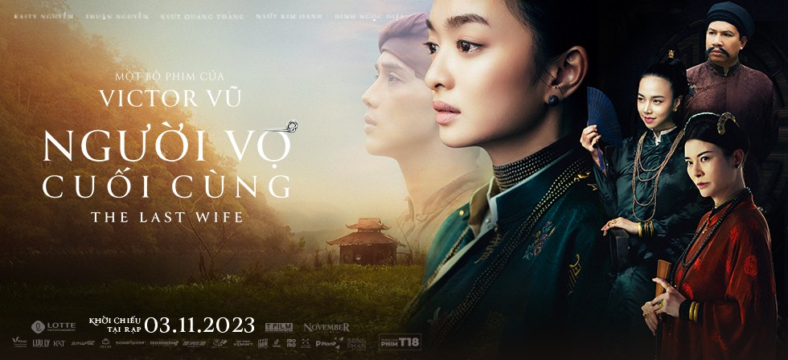

# Người Vợ Cuối Cùng

- **Đạo diễn:** Victor Vũ
- **Diễn viên:** Kaity Nguyễn, Quang Thắng, Kim Oanh, Quốc Huy
- **Thể loại:** Cổ trang, Tâm lý, Tình cảm, Trinh thám
- **Khởi chiếu:** 3/11/2024

## Đánh giá :star:

- **Kịch bản:** 6/10
- **Diễn xuất:** 7/10
- **Hình ảnh:** 8/10
- **Âm nhạc:** 7/10
- **Tổng quan:** 7/10

## Tóm tắt

"Lấy bối cảnh Bắc bộ thế kỷ 19, Người Vợ Cuối Cùng xoay quanh câu chuyện của Linh (Kaity Nguyễn), một thiếu nữ nhà nghèo bị ép gả cho quan tri huyện (Quang Thắng). Chịu nhiều bất công và tủi nhục trong cuộc sống hôn nhân, Linh tìm đến mối tình đầu Nhân (Thuận Nguyễn) để giải tỏa tâm lý. Tuy nhiên, mối tình vụng trộm này dẫn đến nhiều bi kịch cho cả hai."

## Đánh giá chi tiết

### Kịch bản

- Lấy cảm hứng từ tiểu thuyết Hồ oán hận, "Người Vợ Cuối Cùng" thay đổi nhiều tình tiết quan trọng. Tuy nhiên, kịch bản phim lại dàn trải, thiếu điểm nhấn với môtíp cũ kỹ về thân phận người vợ lẽ thời xưa. Lối kể chuyện thiếu đi sự đột phá khiến phim trở nên khá dễ đoán.

### Diễn xuất

- Kaity Nguyễn là điểm sáng của phim với diễn xuất ấn tượng. Cô đã thể hiện thành công hình ảnh người phụ nữ chịu nhiều bi kịch, từ ánh mắt u uẩn đến những biểu cảm đau khổ, phẫn uất. Các diễn viên phụ như Quang Thắng, Kim Oanh hoàn thành tốt vai diễn của mình nhưng chưa thực sự nổi bật. Quốc Huy tạo ấn tượng với vai diễn quan tra án thông minh, quyết đoán.

### Hình ảnh

- "Người Vợ Cuối Cùng" sở hữu phần hình ảnh đẹp mắt với bối cảnh được dàn dựng kỹ lưỡng. Phim sử dụng nhiều góc máy flycam, phác họa vẻ đẹp sơn thủy hữu tình của làng quê Bắc bộ thế kỷ 19. Trang phục được thiết kế tỉ mỉ, góp phần thể hiện rõ thân phận và tính cách nhân vật.

### Âm nhạc

- Nhạc phim được sử dụng hiệu quả, góp phần tạo thêm bầu không khí cho các cảnh quay.
<>
  <iframe
    width="560"
    height="315"
    src="https://www.youtube.com/embed/5ys3jP-tV44?si=PfyV_rhTy_e1PQjM"
    frameBorder="0"
    allow="accelerometer; autoplay; clipboard-write; encrypted-media; gyroscope; picture-in-picture; web-share"
    allowFullScreen
    title="GÓC TỐI | MV OST NGƯỜI VỢ CUỐI CÙNG | THÙY CHI"
  ></iframe>
</>

## Kết luận

"Người Vợ Cuối Cùng" là một bộ phim cổ trang đẹp về phần nhìn nhưng thiếu đi sự đột phá trong nội dung. Phim phù hợp với những ai yêu thích dòng phim cổ trang, lãng mạn và muốn thưởng thức phần hình ảnh đẹp mắt.

## Lưu ý

- Bài viết này được viết dựa trên suất chiếu sớm của phim.
- Bài viết có thể tiết lộ một phần nội dung phim.

🎬 [Người Vợ Cuối Cùng Full HD](https://redphim.com/chi-tiet-phim/nguoi-vo-cuoi-cung) | 🔴 [RedPhim](https://redphim.com)